##SQL Server & Continuous Integration
<br>
James Anderson
<br>
www.TheDatabaseAvenger.com
<br>
@DatabaseAvenger
<br>
James@TheSQLPeople.com

http://thedatabaseavenger.com/2016/07/sql-server-and-continuous-integration/

---

##Continuous Integration?


<br>
Moving quickly from ideas to production
<!-- .element: class="fragment" -->

<br>
Catching errors early<!-- .element: class="fragment" -->

<br>
Continually integrating
<!-- .element: class="fragment" -->

---

##It's not just a suite of tools

<br>
Although, that will be my focus today<!-- .element: class="fragment" -->

---

You don't need the Ferrari of build servers


---

You can still get there for less


---

Continuous Integration with SQL Server

<br>
Why is deploying database changes so difficult?<!-- .element: class="fragment" -->

---

State based Vs Migration based

---

The Hybrid Approach


---

ReadyRoll Demo

+++


+++


+++


+++


+++


+++


+++


+++


+++


http://thedatabaseavenger.com/2016/10/starting-a-readyroll-project/

+++


+++

```sql
CREATE TABLE Customers 
(
	CustomerID INT IDENTITY(1,1) NOT NULL,
	Title NVARCHAR(25) NOT NULL,
	FirstName NVARCHAR(100) NOT NULL,
	LastName NVARCHAR(100) NOT NULL,
	DOB DATE NOT NULL,
	CONSTRAINT [PK_CustomerID] PRIMARY KEY CLUSTERED  
	(
		[CustomerID] ASC
	) WITH (PAD_INDEX = ON) ON [PRIMARY]
) ON [PRIMARY];
GO
```

+++

```sql
CREATE TABLE Config
(
	Setting			NVARCHAR(250) NOT NULL,
	[Description]	NVARCHAR(1000) NOT NULL,
	[Value]			NVARCHAR(100) NULL,
	CONSTRAINT PK_Config_Setting PRIMARY KEY (Setting)
);
GO

CREATE PROCEDURE ConfigSettings 
AS
BEGIN
	SELECT	Setting,
			[Value]
	FROM	dbo.Config;
END
```

+++


+++

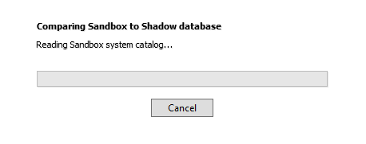

+++

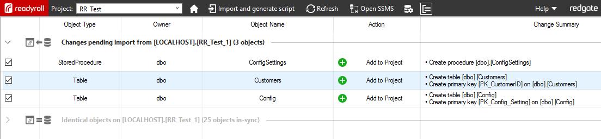

+++

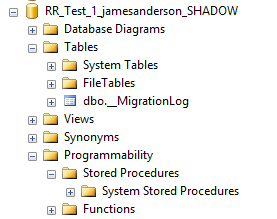

+++

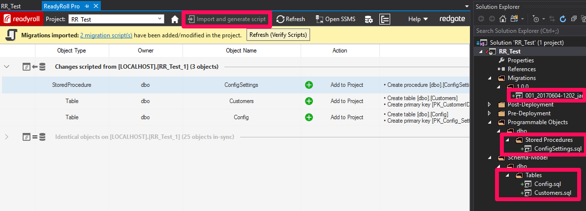

+++

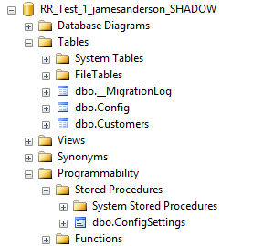

+++

Migration scripts are for stateful objects only.

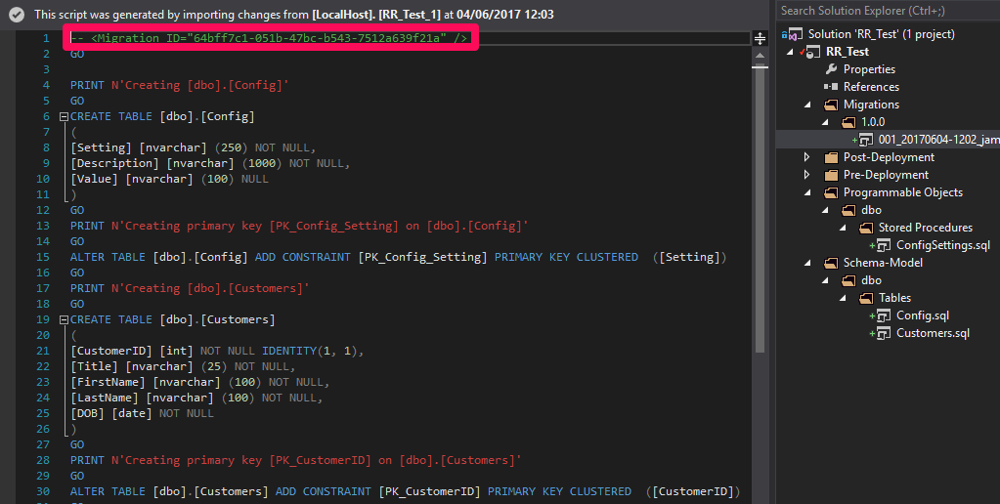

+++


+++

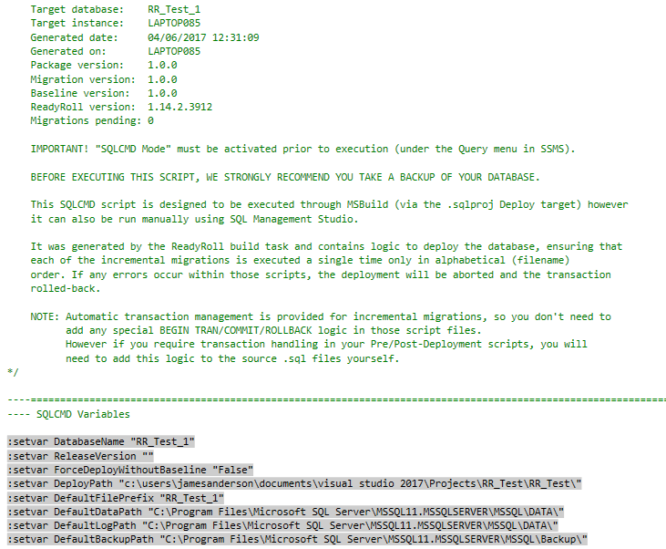

+++

```sql
ALTER TABLE Config ALTER COLUMN [Value] NVARCHAR(MAX);
GO

ALTER PROCEDURE ConfigSettings 
				@Setting NVARCHAR(250) = N'All'
AS
BEGIN
	SELECT	c.Setting,
			c.[Value]
	FROM	dbo.Config c
	WHERE	(
				(@Setting = N'All')
				OR
				(@Setting = c.Value)
			);
END
```

+++

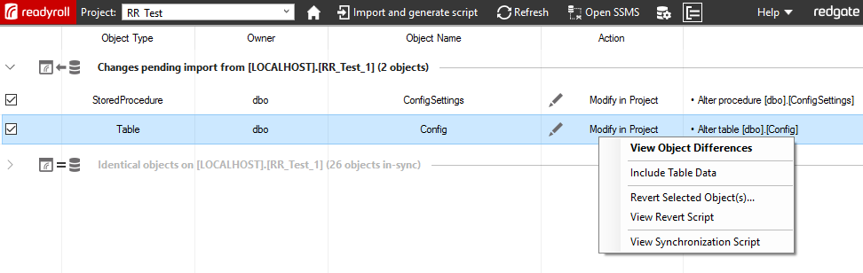

+++

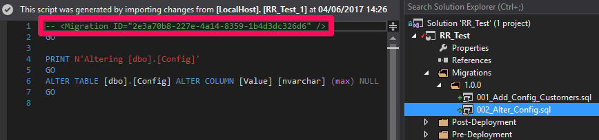

+++

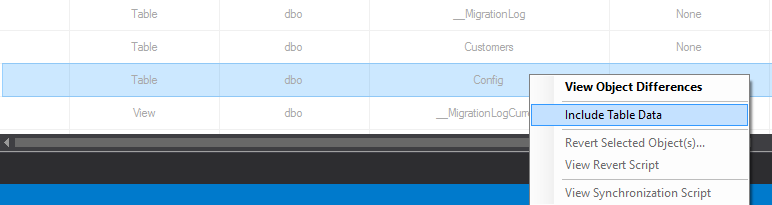

+++

```sql
INSERT dbo.Config(Setting, Description, Value)
VALUES	('Active', 'Is the appllication active', 'Y'),
		('Client', 'The name of the client for this instance', 'The SQL People Ltd'),
		('Client Email', 'Email address to send reports to', 'James@TheSQLPeople.com'); 
GO
```

+++

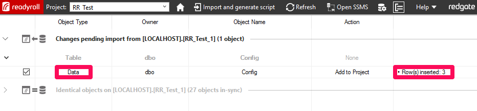

+++

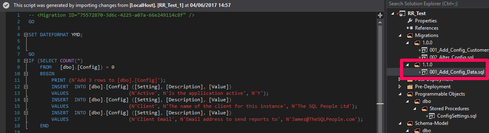

---

Unit Tests


* tSQLt<!-- .element: class="fragment" -->
* PowerShell<!-- .element: class="fragment" -->
* Pester<!-- .element: class="fragment" -->

---

tSQLt Demo

+++

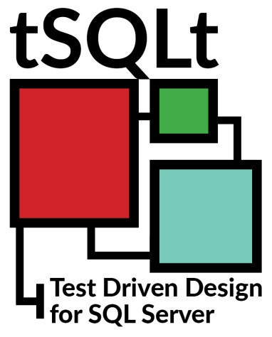


http://tsqlt.org/

+++

Create a test class for a new SP
```sql
EXEC tSQLt.NewTestClass 'testFinancialApp';
```

+++

Create new SP to test
```sql
CREATE FUNCTION dbo.ConvertCurrency 
(
    @rate DECIMAL(10,4), 
    @amount DECIMAL(10,4)
)
RETURNS DECIMAL(10,4)
AS
BEGIN
	DECLARE @Result DECIMAL(10,4);

	SET @Result = (SELECT @amount / @rate);

	RETURN @Result;
END;
```

+++

```sql
CREATE PROCEDURE testFinancialApp.[test that ConvertCurrency converts using given conversion rate]
AS
BEGIN
    DECLARE @actual DECIMAL(10,4);
    DECLARE @rate DECIMAL(10,4) = 1.2;
    DECLARE @amount DECIMAL(10,4) = 2.00;

    SELECT @actual = dbo.ConvertCurrency(@rate, @amount);

    DECLARE @expected DECIMAL(10,4) = 2.4;  

    EXEC tSQLt.AssertEquals @expected, @actual;
END;
```

+++

Run the tests!
```sql
EXEC tSQLt.Run 'testFinancialApp';
```

+++

Fail

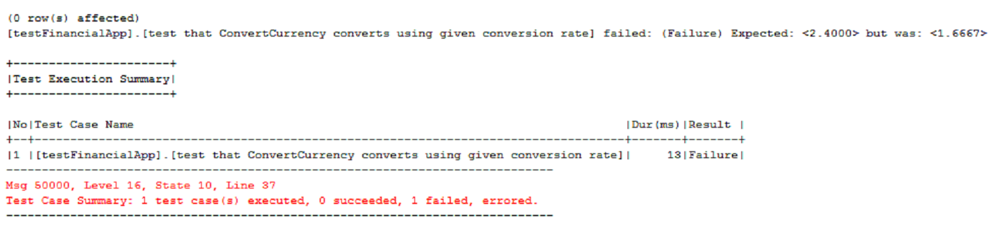

+++
Alter the calculation
```sql
ALTER FUNCTION dbo.ConvertCurrency 
(
    @rate DECIMAL(10,4), 
    @amount DECIMAL(10,4)
)
RETURNS DECIMAL(10,4)
AS
BEGIN
	DECLARE @Result DECIMAL(10,4);

	SET @Result = (SELECT @amount * @rate);

	RETURN @Result;
END;
```

+++

Success

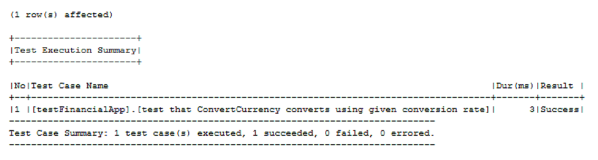

---

Pester Demo

+++

Sample Test

```powershell
Describe "Get-SQLInfo" {
    It "returns $true" {
        Get-SQLInfo | Should Be $true
    }
}
```

+++

Test Driven Design


<br>
```powershell
New-Fixture -Path Temp -Name Get-SQLInfo
```

+++

New function
```powershell
function Get-SQLInfo {
	param ($a)
    
    if ($a -eq 1) {$true} else {$false}
}
```

+++

Linked Test Script

```powershell
$here = Split-Path -Parent $MyInvocation.MyCommand.Path
$sut = (Split-Path -Leaf $MyInvocation.MyCommand.Path).Replace(".Tests.", ".")
. "$here\$sut"

Describe "Get-SQLInfo" {
    It "returns $true when `$a = 1" {
        Get-SQLInfo 1 | Should Be $true
    }
	It "returns $false when `$a = 0" {
        Get-SQLInfo 0 | Should Be $false
    }
}
```

+++

Mocking


Faking the response of a piece of code that we aren't currently testing<!-- .element: class="fragment" -->

+++

Sample Test with Mocking

```powershell
Context "Get-Random is not random" {
		Mock Get-Random { return 3 }
		It "Get-Random returns 3" {
			Get-SQLInfo | Should be 3
		}
	}
```

+++

Sample Test with Mocking Assert

```powershell
Context "Get-Random is not random" {
		Mock Get-Random { return 3 }
		It "Get-Random returns 3" {
			Get-SQLInfo | Should be 3
			Assert-MockCalled Get-Random -Exactly 1
		}
	}
}
```

+++

`GitLab


---

GitLab Features

<br>
* Remote repository
* Build server with CI pipelines
* Issue management \ Bug tracking
* Documentation (I love this)

---

GitLab Demo

+++

Login with Active Directory
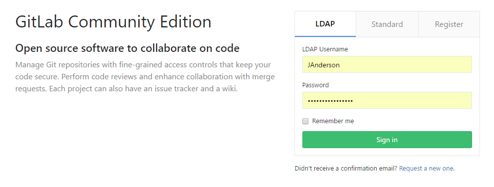

+++

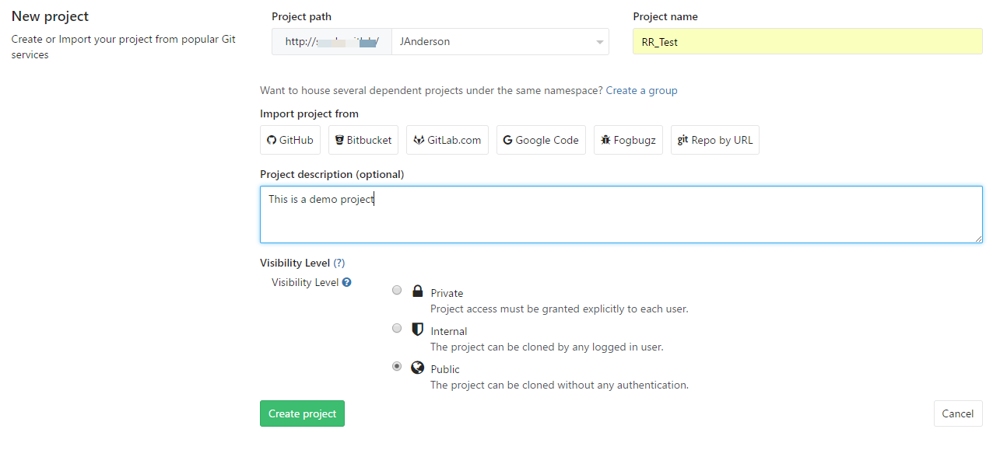

+++

GitLab Runners

+++

Install Runner Agent
```bash
cd c:\Projects\RR_Test
git remote add origin http://GITLAB/JAnderson/RR_Test.git
git push -u origin master
```

+++

Configure a runner

+++

Runner is connected to GitLab

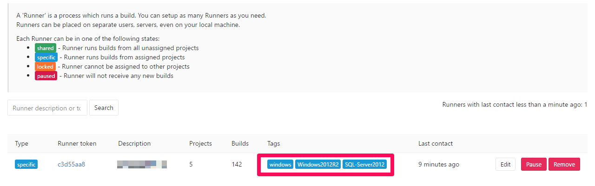

+++

Assign Runner to a project

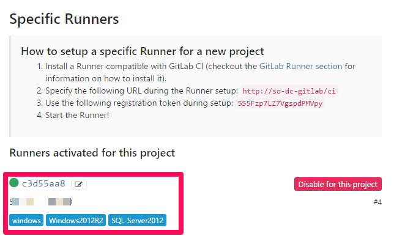

+++

Configure a pipeline with .gitlab-ci.yml 

```yaml
job:
  script: '"C:\Program Files (x86)\MSBuild\14.0\Bin\MSBuild.exe"'
  tags:
    - windows
```

+++

Commit a change to trigger a build
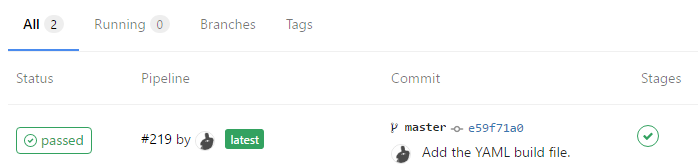

+++

.gitlab-ci.yml V2

```yaml
build:
  script: 
  - powershell "& 'C:\Program Files (x86)\MSBuild\14.0\Bin\MSBuild.exe' 'RR_Test.sqlproj' /p:TargetServer=LocalHost /p:TargetDatabase=RR_Test /p:Configuration=Release /p:GenerateSqlPackage=True /p:DBDeployOnBuild=True /p:ShadowServer=LocalHost" 
  tags:
    - windows

test:
  script: 
  - powershell .\TestHarness.ps1 %CI_PROJECT_DIR% 'LocalHost' 'RR_Test'  
  tags:
    - windows
  artifacts:
    paths:
    - RR_Test/bin/
    untracked: true
```

+++

Review build artifacts

---

So now we have automatic testing everytime we make a change.


All is good<!-- .element: class="fragment" -->


But...<!-- .element: class="fragment" -->

---

I want to test the project against all versions of SQL Server

<br>
I also want to test upgrading from each version of my project

---


---

Testing With Docker Demo

+++

Enable Hyper-V

Install Docker for Windows

+++

Pull an image

```bash
docker pull  
```

---

Thanks for listening
<br>
<br>
Any questions?
<br>
<br>
www.TheDatabaseAvenger.com
<br>
@DatabaseAvenger
<br>
James@TheSQLPeople.com
