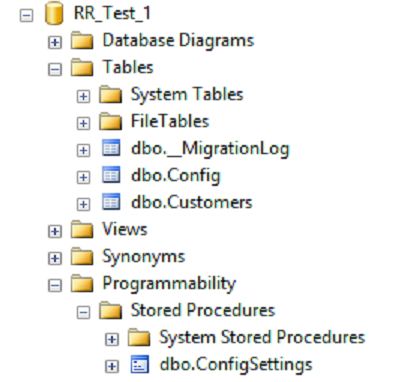

***SQL Server & Continuous Integration***
 
James Anderson
 
www.TheDatabaseAvenger.com
 
@DatabaseAvenger
 
James@TheSQLPeople.com

http://thedatabaseavenger.com/2016/07/sql-server-and-continuous-integration/

---

What is CI?

 
It's not just a suite of tools<!-- .element: class="fragment" -->

 
Moving quickly from ideas to production
<!-- .element: class="fragment" -->

 
Continually integrating
<!-- .element: class="fragment" -->

---

What do I need for CI?

 
Team buy in<!-- .element: class="fragment" -->

 
Tools<!-- .element: class="fragment" -->

---

You don't need the Ferrari of build servers

---

You can still get there for less

---

What can stop us?

 
Slow cycles<!-- .element: class="fragment" -->

* Approvals<!-- .element: class="fragment" -->
* Manual Testing<!-- .element: class="fragment" -->
* Low buy in<!-- .element: class="fragment" -->

---

Why is deploying database changes so difficult?

---

State based Vs Migration based

---

The Hybrid Approach

---

ReadyRoll Demo

+++

+++

+++

+++

+++

+++

+++

+++

+++

http://thedatabaseavenger.com/2016/10/starting-a-readyroll-project/

+++

+++

+++

---

GitLab

---

GitLab Features

 
* Remote repository
* Build server with CI pipelines
* Issue management \ Bug tracking
* Documentation (I love this)

---

GitLab Demo

---

Tests

 
* tSQLt
* Pester
* Docker

---

Run the Tests Demo

---

So now we have automatic testing everytime we make a change.

All is good<!-- .element: class="fragment" -->

But...<!-- .element: class="fragment" -->

---

Test the project against all versions of SQL Server

---

---

Run Tests Against Containers Demo

---

Thanks for listening
 
 
Any questions?
 
 
www.TheDatabaseAvenger.com
 
@DatabaseAvenger
 
James@TheSQLPeople.com
