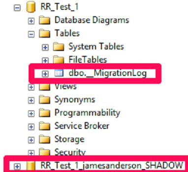
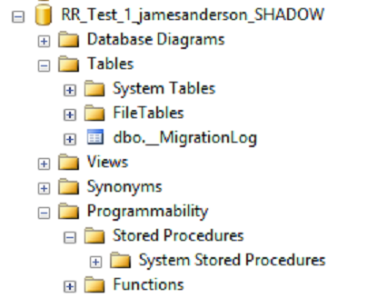
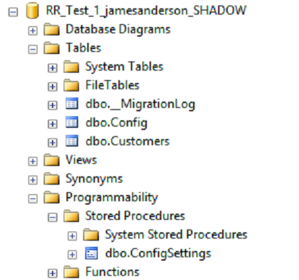
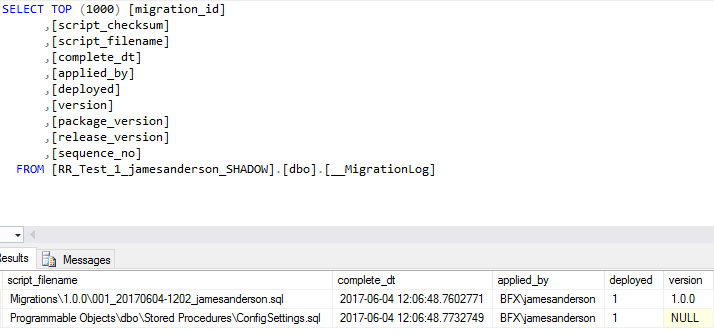

***SQL Server & Continuous Integration***
<br>
James Anderson
<br>
www.TheDatabaseAvenger.com
<br>
@DatabaseAvenger
<br>
James@TheSQLPeople.com

http://thedatabaseavenger.com/2016/07/sql-server-and-continuous-integration/

---

What is CI?


<br>
It's not just a suite of tools<!-- .element: class="fragment" -->

<br>
Moving quickly from ideas to production
<!-- .element: class="fragment" -->

<br>
Continually integrating
<!-- .element: class="fragment" -->

---

What do I need for CI?


<br>
Team buy in<!-- .element: class="fragment" -->


<br>
Tools<!-- .element: class="fragment" -->

---

You don't need the Ferrari of build servers


---

You can still get there for less


---

What can stop us?


<br>
Slow cycles<!-- .element: class="fragment" -->


* Approvals<!-- .element: class="fragment" -->
* Manual Testing<!-- .element: class="fragment" -->
* Low buy in<!-- .element: class="fragment" -->

---

Why is deploying database changes so difficult?

---

State based Vs Migration based

---

The Hybrid Approach


---

ReadyRoll Demo

+++


+++


+++


+++


+++


+++


+++


+++



+++


http://thedatabaseavenger.com/2016/10/starting-a-readyroll-project/

+++


+++

```sql
CREATE TABLE Customers 
(
	CustomerID INT IDENTITY(1,1) NOT NULL,
	Title NVARCHAR(25) NOT NULL,
	FirstName NVARCHAR(100) NOT NULL,
	LastName NVARCHAR(100) NOT NULL,
	DOB DATE NOT NULL,
	CONSTRAINT [PK_CustomerID] PRIMARY KEY CLUSTERED  
	(
		[CustomerID] ASC
	) WITH (PAD_INDEX = ON) ON [PRIMARY]
) ON [PRIMARY];
GO
```

+++

```sql
CREATE TABLE Config
(
	Setting			NVARCHAR(250) NOT NULL,
	[Description]	NVARCHAR(1000) NOT NULL,
	[Value]			NVARCHAR(100) NULL,
	CONSTRAINT PK_Config_Setting PRIMARY KEY (Setting)
);
GO

CREATE PROCEDURE ConfigSettings 
AS
BEGIN
	SELECT	Setting,
			[Value]
	FROM	dbo.Config;
END
```

+++


+++


+++


+++



+++


+++



+++

Migration scripts are for stateful objects only.


+++



+++


+++

```sql
ALTER TABLE Config ALTER COLUMN [Value] NVARCHAR(MAX);
GO

ALTER PROCEDURE ConfigSettings 
				@Setting NVARCHAR(250) = N'All'
AS
BEGIN
	SELECT	c.Setting,
			c.[Value]
	FROM	dbo.Config c
	WHERE	(
				(@Setting = N'All')
				OR
				(@Setting = c.Value)
			);
END
```

+++


+++


+++


+++

```sql
INSERT dbo.Config(Setting, Description, Value)
VALUES	('Active', 'Is the appllication active', 'Y'),
		('Client', 'The name of the client for this instance', 'The SQL People Ltd'),
		('Client Email', 'Email address to send reports to', 'James@TheSQLPeople.com'); 
GO
```

+++


+++


---

Unit Tests


* tSQLt<!-- .element: class="fragment" -->
* PowerShell<!-- .element: class="fragment" -->
* Pester<!-- .element: class="fragment" -->

---

tSQLt Demo

+++


http://tsqlt.org/

+++

Create a test class for a new SP
```sql
EXEC tSQLt.NewTestClass 'testFinancialApp';
```

+++

Create new SP to test
```sql
CREATE FUNCTION dbo.ConvertCurrency 
(
    @rate DECIMAL(10,4), 
    @amount DECIMAL(10,4)
)
RETURNS DECIMAL(10,4)
AS
BEGIN
	DECLARE @Result DECIMAL(10,4);

	SET @Result = (SELECT @amount / @rate);

	RETURN @Result;
END;
```

+++

```sql
CREATE PROCEDURE testFinancialApp.[test that ConvertCurrency converts using given conversion rate]
AS
BEGIN
    DECLARE @actual DECIMAL(10,4);
    DECLARE @rate DECIMAL(10,4) = 1.2;
    DECLARE @amount DECIMAL(10,4) = 2.00;

    SELECT @actual = dbo.ConvertCurrency(@rate, @amount);

    DECLARE @expected DECIMAL(10,4) = 2.4;  

    EXEC tSQLt.AssertEquals @expected, @actual;
END;
```

+++

Run the tests!
```sql
EXEC tSQLt.Run 'testFinancialApp';
```

+++

Fail


+++
Alter the calculation
```sql
ALTER FUNCTION dbo.ConvertCurrency 
(
    @rate DECIMAL(10,4), 
    @amount DECIMAL(10,4)
)
RETURNS DECIMAL(10,4)
AS
BEGIN
	DECLARE @Result DECIMAL(10,4);

	SET @Result = (SELECT @amount * @rate);

	RETURN @Result;
END;
```

+++

Success!


---

Pester Demo

+++

Sample Test

```powershell
Describe "Get-SQLInfo" {
    It "returns $true" {
        Get-SQLInfo | Should Be $true
    }
}
```

+++

Test Driven Design


<br>
```powershell
New-Fixture -Path Temp -Name Get-SQLInfo
```

+++

New function
```powershell
function Get-SQLInfo {
}
```

+++

Linked Test Script

```powershell
$here = Split-Path -Parent $MyInvocation.MyCommand.Path
$sut = (Split-Path -Leaf $MyInvocation.MyCommand.Path).Replace(".Tests.", ".")
. "$here\$sut"

Describe "Get-SQLInfo" {
	It "does something useful" {
		$true | Should Be $false
	}
}
```

---

GitLab


---

GitLab Features

<br>
* Remote repository
* Build server with CI pipelines
* Issue management \ Bug tracking
* Documentation (I love this)

---

GitLab Demo

---

So now we have automatic testing everytime we make a change.


All is good<!-- .element: class="fragment" -->


But...<!-- .element: class="fragment" -->

---

Testing locally and against my test server isn't good enough

<br>
I want to test the project against all versions of SQL Server

---


---

Testing With Docker Demo

---

Thanks for listening
<br>
<br>
Any questions?
<br>
<br>
www.TheDatabaseAvenger.com
<br>
@DatabaseAvenger
<br>
James@TheSQLPeople.com
